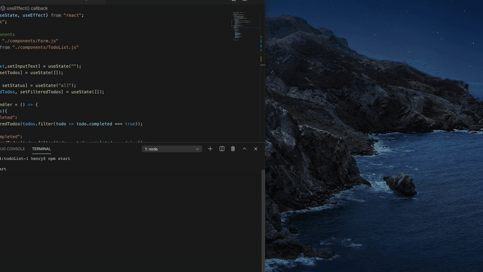

# todoList-1
A minimal todo-list web app with React, unfortunately. Structure [inspired from here](https://www.youtube.com/watch?v=pCA4qpQDZD8). 
Try out the [latest version here](https://todolist-one1.netlify.app).
  

## Feb 23.

Elements almost fully functional (add, delete, and <i>check</i> agendums) (thanks Ed!). 
Playing around with formatting + feature to reorder list + fix dropdown.
 
### TODO:
<ul>
  <li>Extend select dropdown</li>
  <li>Registration</li>
  <li><s>Publish!</s>netlify way too good (Mar. 10)</li>
  <li>Web accessible lists via links</li>
    
  <li>Insert <i>this</i> todo list?</li>
</ul>

